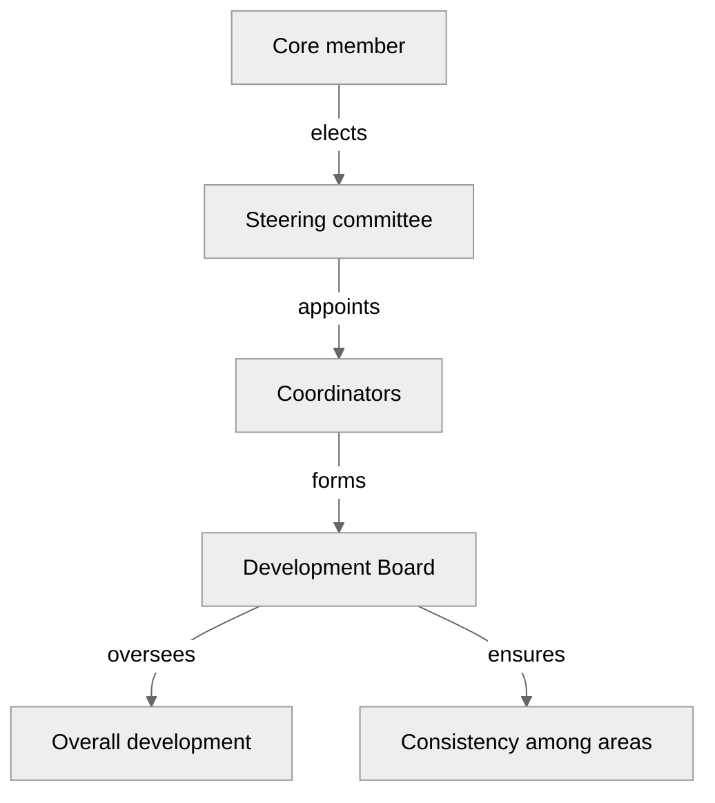

# Governance igraph

igraph is a collection of network analysis tools with the emphasis on efficiency, portability and ease of use. The package is open source and free and has interfaces in R, Python, Mathematica with the core of the package being developed in C/C++. The igraph organisation assumes responsibility and ownership for these three interfaces and the C/C++ core, which can be considered an interface on its own as well.

## Overview

This document describes how the igraph organisation is governed, and how rights and responsibilities are assigned. In a nutshell, the core members elect a steering committee that then appoints coordinators, at least one coordinator for each "area" (part of the igraph project). Each interface (including the C/C++ interface) and possibly other topics (website, documentation, ...) comprise an area, with the coordinator being responsible for that particular area. The coordinators jointly form the development board, which oversees overall development and ensures consistency among the various areas. Below is a visualisation of the governance structure.

In the regulations below we describe in more detail the rights and responsibilities for each separate role, and also describe in more detail the governing process.

Unless indicated otherwise, a simple majority refers to an outcome that is supported by more than 50% of the votes. For example, 6/12 does not constitute a simple majority, but 7/12 does. A qualified majority refers to an outcome that is supported by more than ⅔ of the votes. For example, 8/12 does not constitute a qualified majority, but 9/12 does.

Unless indicated otherwise, a quorum of at least 50% is required for any vote. That is, if less than 50% of the core members vote, the outcome is invalid. For example, if only 9/20 eligible people vote, no quorum is established, while if 10/20 vote, a quorum is established.

Any vote will be communicated on the [igraph forum](https://igraph.discourse.group/) (possibly in a private topic if sensitive details are shared).

## Regulations

### 1. Core members

1. Core members represent the igraph community that actively contributes to helping to maintain, develop and support igraph.
2. A list of members will be maintained on the igraph `.github` repository in [`MEMBERS.md`](https://github.com/igraph/.github/blob/main/MEMBERS.md).
3. Core members can be added by existing members. This requires
    1. nomination by 1 existing core member and support of 2 other core members;
    2. subsequent approval of the addition of the core member by a simple majority.
4. Core members can decide to leave voluntarily at any time. Core members are encouraged to revise their voluntary involvement (e.g. https://www.volunteeramnestyday.net/).
    1. The number of core members cannot drop below 3, and members that leave in that case are required to nominate somebody else.
5. Core members can be expelled and removed from their membership. This requires
    1. report by 1 existing core member and support of 2 other core members;
    2. subsequent approval of the expulsion of the core member by a qualified ⅔ majority of the other core members.
    3. Only responses within 4 weeks after the communication of the report for the expulsion will be counted for establishing a simple or qualified majority, and require the indicated quorum to be considered a valid outcome.
6. In case of transgressions of the code of conduct, core members can also be expelled. This requires
    1. report by 1 existing core member or the steering committee
    2. providing proof of the misconduct to the other core members.
    3. subsequent approval of the expulsion of the core member by a simple majority, solely on the grounds of the provided proof. A written report of the decision and the arguments will be made public while respecting the privacy of individuals involved.
    4. Only responses within 4 weeks after the communication of the report for the expulsion will be counted for establishing a simple or qualified majority, and require the indicated quorum to be considered a valid outcome.
7. Core members who have not expressed a vote for three consecutive opportunities (excluding leave) are considered to have become inactive. They will be requested to become active again. Failure to respond within 4 weeks automatically removes the inactive member.
8. Core members can elect/remove steering committee members, see steering committee for detail.
9. This document will be reviewed by core members on a yearly basis.
10. Revisions of this document require a qualified majority to agree with its new content. This article itself is exempt from revisions.

### 2. Steering committee
1. The steering committee is responsible for ensuring the sustainable development and maintenance of igraph.
    1. The steering committee is responsible for ensuring that an operational structure is in place for managing the igraph project.
    2. The steering committee is responsible for ensuring the financial security of the igraph project.
2. The steering committee consists of three positions: chair, secretary and treasurer.
    3. The chair is responsible for chairing the steering committee meeting.
    4. The secretary is responsible for recording steering committee minutes and decisions and circulating agendas.
    5. The treasurer is responsible for monitoring the financial situation of the igraph project.
3. The steering committee is elected by the core members.
    1. Any person can be nominated as a member of the steering committee by the core members. Nominated persons do not need to be core members themselves. Self-nomination is possible.
    2. Positions in the steering committee will typically follow a staggered rotational election schedule. Each position in the steering committee is appointed for 1 or 2 years, and the duration is determined by the preceding steering committee.
    3. Core members vote for the steering committee. Each core member has as many votes as there are open positions. The nominees with the most votes will be appointed at the steering committee for the open positions. In the case of ties, the previous steering committee can cast a decisive vote.
    4. The steering committee will appoint somebody to oversee the election process. In case this person is a core member, (s)he cannot vote in the election.
4. Members of the steering committee can be removed from their position by the core members. This requires:
    1. nomination by 1 existing core member and support from 2 other core members.
    2. subsequent approval of the removal by a qualified ⅔ majority of the core members.
5. The steering committee has the authority to:
    1. Manage existing funds and authorise new funding applications, in line with the overall development roadmap.
    2. Organise access to various organisations relevant to igraph:
        1. All GitHub repositories
        2. Packaging indices, including at least
            1. PyPI
            2. CRAN
        3. Relevant websites, including the main domain name igraph.org and its content.
        4. igraph support forum
        5. social media, such as Twitter or Mastodon.
    3. Authorise non-standard output from the igraph project, such as special events, activities or publications. This explicitly excludes any releases of igraph and its interfaces.
    4. Ownership and management of trademarks, copyright and licences in consultation with the development board.
6. The steering committee has the authority to manage igraph's code of conduct and deal with possible transgressions. If a transgression involves core members and the steering committee wishes to expel a core member, this can only be done following the procedure outlined in 1.6.
7. The steering committee appoints coordinators (see also section 3).
    1. The appointment is done on the basis of a simple majority.
    2. The duration of the appointment is two years, but the steering committee can deviate from this with proper motivation.
    3. Removal of a coordinator from his/her position can only be done by full consensus of the steering committee.
8. The steering committee will meet at least four times a year.
    1. The chair is responsible for scheduling the meeting and preparing an agenda.
    2. The agenda should be circulated at least 2 weeks in advance, and items can be added to the agenda by any core member.
    3. Minutes of the meeting will be made by the secretary and will be made publicly available.
9. Ad-hoc proposals for decision or ad-hoc meetings by the steering committee are possible, and decisions can for instance also be made in GitHub issues or on the forum.
    1. Decisions should be made publicly with a public record.
    2. The steering committee members are expected to have responded within a week, unless there are mitigating circumstances (e.g. leave, holidays).
10. Decisions by the steering committee will be made on the basis of a simple majority. Decisions can only be made by the full steering committee.

## 3. Coordinators
1. A coordinator is responsible for the development and maintenance of a part of igraph ("area") and its community. "Responsibility" means:
    1. Has executive and sole decision power regarding questions entirely within the realm of the respective area.
    2. Is provided with administrative access to all system accounts (e.g., GitHub repositories) needed for efficient work.
    3. Communicates proactively with other coordinators regarding matters that affect multiple areas, seeking consensus with and approval by the development board, see also 3.5.
    4. Is accountable towards the steering committee and the community for their actions.
2. A coordinator is appointed by the steering committee, see also 2.7.
3. There will be at least four interface coordinators, one coordinator for each interface: R, Python, Mathematica and C/C++. An interface coordinator bears ultimate responsibility for a particular interface, in line with 3.1.
    1. Development is expected to be in line with the overall development roadmap that is set out by the development board.
    2. Other team members may be involved with the development, but the  responsibility remains with the interface coordinator.
4. Additional coordinators may be appointed by the steering committee (e.g. website, documentation, plotting).
5. Changes that have any cross-cutting effects must be approved by the development board, see 4.2.4.

## 4. Development board
 1. The development board is formed by the appointed coordinators.
 2. The development board has the authority to:
     1. Manage the development roadmap
     2. Manage contributing guidelines and overall merge strategy
     3. Review and decide on functionality proposals
     4. Approve any changes that have potential cross-cutting effects. This includes major releases and any other API breaking changes. In case of uncertainty of potential cross-cutting effect, the development board shall decide.
 3. The development board will designate one coordinator as chair of the development board and one coordinator as secretary.
 4. The development board will meet at least twice a year.
     1. The chair is responsible for scheduling the meeting and preparing an agenda.
     2. The agenda should be circulated at least 2 weeks in advance, and items can be added to the agenda by any coordinator.
     3. Minutes of the meeting will be made by the secretary and will be made publicly available.
 5. Decisions are preferably taken in consensus, but if necessary the members of the development board can vote.
     1. Each coordinator has one vote, but may abstain from voting (their abstinence is not counted towards a quorum).
     2. Decisions are made by a simple majority.
     3. In case of ties, the steering committee is consulted.
 6. Ad-hoc proposals for decisions or ad-hoc meetings by the development board are possible, and decisions can for instance also be made in GitHub issues or on the forum.
     1. Decisions should be made publicly with a public record.
     2. Development board members are expected to have responded within a week, unless there are mitigating circumstances (e.g. leave, holidays).